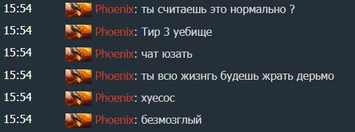
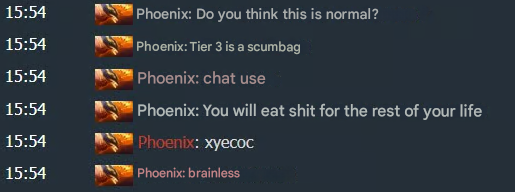

##### How to use

#### 1 Download and install Tesseract OCR:

- Download the Tesseract installer from this link: https://github.com/UB-Mannheim/tesseract/wiki
- Run the installer and follow the installation instructions.
- Add Tesseract to your system's PATH:

Optional: Add more language support for Tesseract
- 
```sh 
git clone https://github.com/tesseract-ocr/tessdata
```
- Take for example rus.traineddata file and paste it in C:\Program Files\Tesseract-OCR\tessdata

##### 2 pip Install Python libraries:
```sh
pip install pytesseract translate Pillow
``` 

##### 3 Screenshot what you need to translate

##### 4 Run in terminal 
```sh
cd ..\repos\ScreenshotTranslator\src
python main.py
```
**Example: Input:**<br>
 

**My scripts Output:**
Translated Text:<br>
Z<br>
156.79<br>
You, are you fine with that<br>
Chat<br>
But if everything works out for you, then for the rest of your life you will fulfill all your dreams.<br>
You're an eyesore<br>

**Google Translate Output:**<br>


It seems like Google Translate and the python library has issues with different lines, and neither approach is fool-proof.